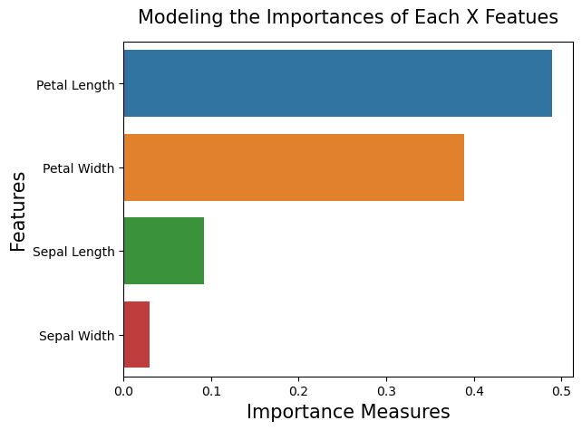
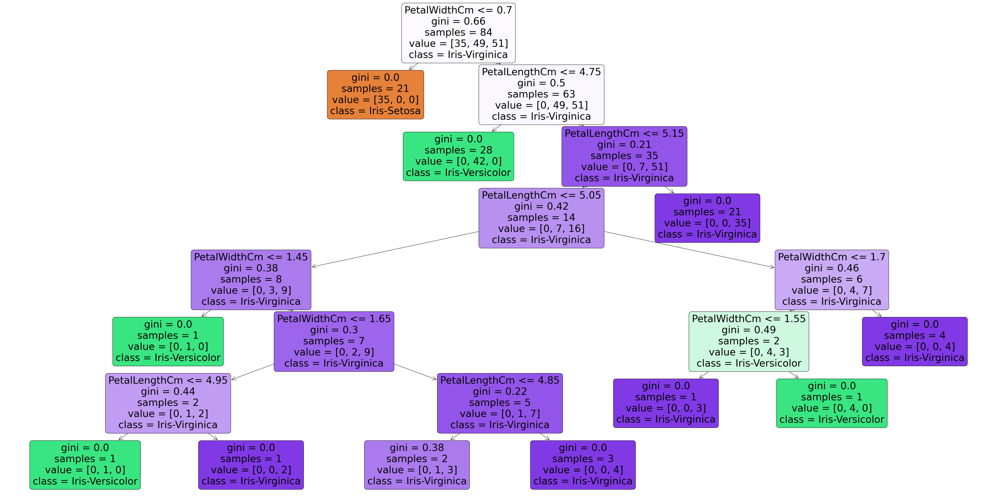

```python
import pandas as pd
import numpy as np
from matplotlib import pyplot as plt
import seaborn as sns
```


```python
# importing csv file from local machine like r'path'
# reading in dataset with panda
df = pd.read_csv(r'C:\Users\kcoma\Jupyter Projects\DataSets\Iris Species\Iris\Iris.csv')
df.head()
```


<div>
<style scoped>
    .dataframe tbody tr th:only-of-type {
        vertical-align: middle;
    }

    .dataframe tbody tr th {
        vertical-align: top;
    }

    .dataframe thead th {
        text-align: right;
    }
</style>
<table border="1" class="dataframe">
  <thead>
    <tr style="text-align: right;">
      <th></th>
      <th>Id</th>
      <th>SepalLengthCm</th>
      <th>SepalWidthCm</th>
      <th>PetalLengthCm</th>
      <th>PetalWidthCm</th>
      <th>Species</th>
    </tr>
  </thead>
  <tbody>
    <tr>
      <th>0</th>
      <td>1</td>
      <td>5.1</td>
      <td>3.5</td>
      <td>1.4</td>
      <td>0.2</td>
      <td>Iris-setosa</td>
    </tr>
    <tr>
      <th>1</th>
      <td>2</td>
      <td>4.9</td>
      <td>3.0</td>
      <td>1.4</td>
      <td>0.2</td>
      <td>Iris-setosa</td>
    </tr>
    <tr>
      <th>2</th>
      <td>3</td>
      <td>4.7</td>
      <td>3.2</td>
      <td>1.3</td>
      <td>0.2</td>
      <td>Iris-setosa</td>
    </tr>
    <tr>
      <th>3</th>
      <td>4</td>
      <td>4.6</td>
      <td>3.1</td>
      <td>1.5</td>
      <td>0.2</td>
      <td>Iris-setosa</td>
    </tr>
    <tr>
      <th>4</th>
      <td>5</td>
      <td>5.0</td>
      <td>3.6</td>
      <td>1.4</td>
      <td>0.2</td>
      <td>Iris-setosa</td>
    </tr>
  </tbody>
</table>
</div>


```python
# Dropping the 'Id' column from our dataframe (since we don't need an additional index).
df.drop("Id", axis=1, inplace=True)

# Viewing our modified dataframe.
df.head()
```


<div>
<style scoped>
    .dataframe tbody tr th:only-of-type {
        vertical-align: middle;
    }

    .dataframe tbody tr th {
        vertical-align: top;
    }

    .dataframe thead th {
        text-align: right;
    }
</style>
<table border="1" class="dataframe">
  <thead>
    <tr style="text-align: right;">
      <th></th>
      <th>SepalLengthCm</th>
      <th>SepalWidthCm</th>
      <th>PetalLengthCm</th>
      <th>PetalWidthCm</th>
      <th>Species</th>
    </tr>
  </thead>
  <tbody>
    <tr>
      <th>0</th>
      <td>5.1</td>
      <td>3.5</td>
      <td>1.4</td>
      <td>0.2</td>
      <td>Iris-setosa</td>
    </tr>
    <tr>
      <th>1</th>
      <td>4.9</td>
      <td>3.0</td>
      <td>1.4</td>
      <td>0.2</td>
      <td>Iris-setosa</td>
    </tr>
    <tr>
      <th>2</th>
      <td>4.7</td>
      <td>3.2</td>
      <td>1.3</td>
      <td>0.2</td>
      <td>Iris-setosa</td>
    </tr>
    <tr>
      <th>3</th>
      <td>4.6</td>
      <td>3.1</td>
      <td>1.5</td>
      <td>0.2</td>
      <td>Iris-setosa</td>
    </tr>
    <tr>
      <th>4</th>
      <td>5.0</td>
      <td>3.6</td>
      <td>1.4</td>
      <td>0.2</td>
      <td>Iris-setosa</td>
    </tr>
  </tbody>
</table>
</div>


```python
# Importing the Label Encoder Class from sklearn
from sklearn.preprocessing import LabelEncoder

# Creating a new label Encoder object
# Encode target labels with value between 0 and n_classes-1.
encoder = LabelEncoder()

# Using the "fit_transform" method to label encode the 'Type' column 0: Private 1: Public In-State  2:Public Out-of-State
df["Species"] = encoder.fit_transform(df["Species"])

df.head(15)
```


<div>
<style scoped>
    .dataframe tbody tr th:only-of-type {
        vertical-align: middle;
    }

    .dataframe tbody tr th {
        vertical-align: top;
    }

    .dataframe thead th {
        text-align: right;
    }
</style>
<table border="1" class="dataframe">
  <thead>
    <tr style="text-align: right;">
      <th></th>
      <th>SepalLengthCm</th>
      <th>SepalWidthCm</th>
      <th>PetalLengthCm</th>
      <th>PetalWidthCm</th>
      <th>Species</th>
    </tr>
  </thead>
  <tbody>
    <tr>
      <th>0</th>
      <td>5.1</td>
      <td>3.5</td>
      <td>1.4</td>
      <td>0.2</td>
      <td>0</td>
    </tr>
    <tr>
      <th>1</th>
      <td>4.9</td>
      <td>3.0</td>
      <td>1.4</td>
      <td>0.2</td>
      <td>0</td>
    </tr>
    <tr>
      <th>2</th>
      <td>4.7</td>
      <td>3.2</td>
      <td>1.3</td>
      <td>0.2</td>
      <td>0</td>
    </tr>
    <tr>
      <th>3</th>
      <td>4.6</td>
      <td>3.1</td>
      <td>1.5</td>
      <td>0.2</td>
      <td>0</td>
    </tr>
    <tr>
      <th>4</th>
      <td>5.0</td>
      <td>3.6</td>
      <td>1.4</td>
      <td>0.2</td>
      <td>0</td>
    </tr>
    <tr>
      <th>5</th>
      <td>5.4</td>
      <td>3.9</td>
      <td>1.7</td>
      <td>0.4</td>
      <td>0</td>
    </tr>
    <tr>
      <th>6</th>
      <td>4.6</td>
      <td>3.4</td>
      <td>1.4</td>
      <td>0.3</td>
      <td>0</td>
    </tr>
    <tr>
      <th>7</th>
      <td>5.0</td>
      <td>3.4</td>
      <td>1.5</td>
      <td>0.2</td>
      <td>0</td>
    </tr>
    <tr>
      <th>8</th>
      <td>4.4</td>
      <td>2.9</td>
      <td>1.4</td>
      <td>0.2</td>
      <td>0</td>
    </tr>
    <tr>
      <th>9</th>
      <td>4.9</td>
      <td>3.1</td>
      <td>1.5</td>
      <td>0.1</td>
      <td>0</td>
    </tr>
    <tr>
      <th>10</th>
      <td>5.4</td>
      <td>3.7</td>
      <td>1.5</td>
      <td>0.2</td>
      <td>0</td>
    </tr>
    <tr>
      <th>11</th>
      <td>4.8</td>
      <td>3.4</td>
      <td>1.6</td>
      <td>0.2</td>
      <td>0</td>
    </tr>
    <tr>
      <th>12</th>
      <td>4.8</td>
      <td>3.0</td>
      <td>1.4</td>
      <td>0.1</td>
      <td>0</td>
    </tr>
    <tr>
      <th>13</th>
      <td>4.3</td>
      <td>3.0</td>
      <td>1.1</td>
      <td>0.1</td>
      <td>0</td>
    </tr>
    <tr>
      <th>14</th>
      <td>5.8</td>
      <td>4.0</td>
      <td>1.2</td>
      <td>0.2</td>
      <td>0</td>
    </tr>
  </tbody>
</table>
</div>


```python
# importing the 'Train Test_split' function from scikit-learn 'model_selection' package
from sklearn.model_selection import train_test_split

# Splitting up our data dataframe into x and y subsets(x are the independ variables and y is the dependent variable types)
x_data = df.drop("Species",axis=1)
y_data = df["Species"]

# Retriveing X and Y train-test sets by calling the 'train_test_split' function (80-20 Split) 
x_train, x_test, y_train , y_test = train_test_split(x_data, y_data, test_size=0.2)
```


```python
# Importing the RandomForestClassifier Class from Scikit-Learn's 'ensemble' package.
from sklearn.ensemble import RandomForestClassifier

# Creating a new classifier with twenty individual decision trees used to build the random forest.
model = RandomForestClassifier(n_estimators=20)

# Training our model on the X and Y train sets.
model.fit(x_train, y_train)
```


    RandomForestClassifier(n_estimators=20)


```python
model.score(x_test, y_test)
```


    0.9666666666666667


```python
# Examining the fratures for the independent variable 

# Feautures of little importance [Eliminated]
# Features of high Importance {Promoted}
```


```python
# Printing out the importance for each independent variable (feature) with the "feature_importances_" field.
feature_imp = pd.Series(model.feature_importances_, index=["Sepal Length", "Sepal Width", "Petal Length", "Petal Width"]).sort_values(ascending=False)
feature_imp

# See which variables contribute the most and which contribute the least


```


    Petal Length    0.488784
    Petal Width     0.389083
    Sepal Length    0.091857
    Sepal Width     0.030277
    dtype: float64


```python
sns.barplot(x = feature_imp, y=feature_imp.index)

plt.title("Modeling the Importances of Each X Featues", pad=15,fontsize=15)
plt.xlabel("Importance Measures", fontsize=15)
plt.ylabel("Features", fontsize=15)

plt.show()
```


    

    


```python
# According to the bar graph,"Sepal Length" & "Sepal Width" Represent a low importances with the featurs we have added
# We will drop the 3 columns: Sepal Length ,Sepal Width and Sepcies on the x variables, y variables will stay the same
# Dropping all non-predicate independent varialbes
x_data = df.drop(["SepalLengthCm", "SepalWidthCm","Species"],axis=1)

y_data = df["Species"]

# The Iris Table 
x_data.head()
```


<div>
<style scoped>
    .dataframe tbody tr th:only-of-type {
        vertical-align: middle;
    }

    .dataframe tbody tr th {
        vertical-align: top;
    }

    .dataframe thead th {
        text-align: right;
    }
</style>
<table border="1" class="dataframe">
  <thead>
    <tr style="text-align: right;">
      <th></th>
      <th>PetalLengthCm</th>
      <th>PetalWidthCm</th>
    </tr>
  </thead>
  <tbody>
    <tr>
      <th>0</th>
      <td>1.4</td>
      <td>0.2</td>
    </tr>
    <tr>
      <th>1</th>
      <td>1.4</td>
      <td>0.2</td>
    </tr>
    <tr>
      <th>2</th>
      <td>1.3</td>
      <td>0.2</td>
    </tr>
    <tr>
      <th>3</th>
      <td>1.5</td>
      <td>0.2</td>
    </tr>
    <tr>
      <th>4</th>
      <td>1.4</td>
      <td>0.2</td>
    </tr>
  </tbody>
</table>
</div>


```python
# Performing our train-test split again on the new x and y datasets.
# Changed the test_size from 0.2 to 0.1 to get a higher accuracy rating
x_train, x_test, y_train, y_test = train_test_split(x_data, y_data, test_size=0.1)

# Fitting a Random Forest model to our new training data.
model = RandomForestClassifier(n_estimators=20)
model.fit(x_train, y_train)

# Printing out the accuracy measure of our model.
print("Model Accuracy: " + str(model.score(x_test, y_test)))
```

    Model Accuracy: 1.0
    


```python
# Importing the 'plot_tree' function (to be used for visualization purposes).
from sklearn.tree import plot_tree

# Setting the size of our figure to 60 by 30.
plt.figure(figsize=(60,30))

# Visualizing one of the decision trees from our Random Forest model.
plot_tree(model.estimators_[5], 
          filled=True,  # specifies whether or not the decision nodes should be filled appropriately or not.
          feature_names = ["PetalLengthCm", "PetalWidthCm"], # names of our independent variables.
          class_names = ["Iris-Setosa", "Iris-Versicolor", "Iris-Virginica"], # values of our dependent variable.
          rounded = True, # rounding probablities.
          proportion = False, # removing percentages.
          precision = 2); # setting number of significant figures to two.
```


    

    


```python

```
